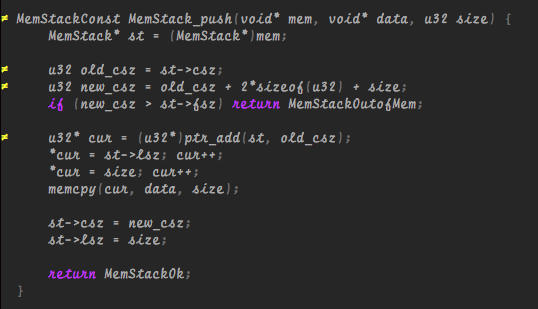

What?
=====

A minimalist color scheme for Neovim and Vim which was inspired from
[typewriter](https://github.com/logico-dev/typewriter).



How?
====

Add below settings into your `.vimrc`:

```vimrc
set termguicolors
colorscheme darkprint
```
